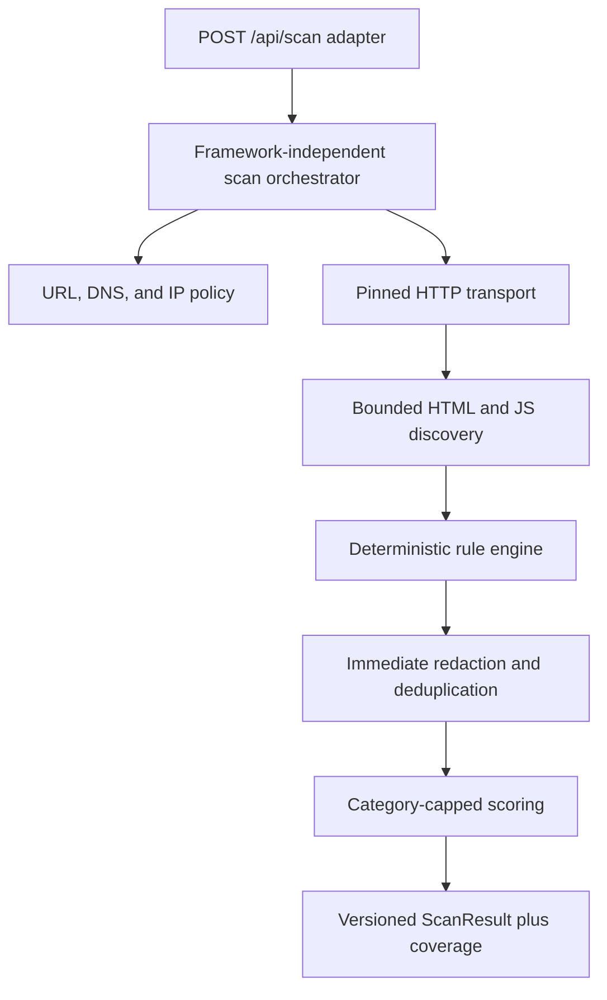
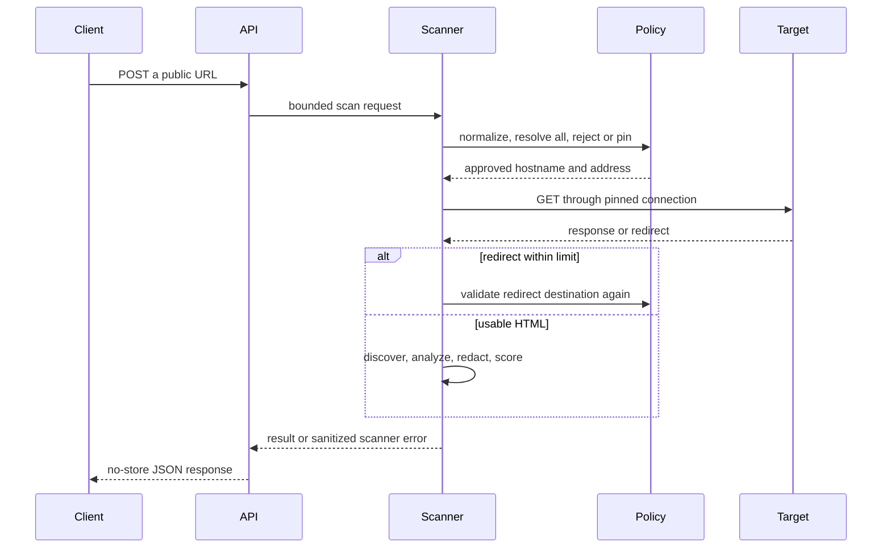
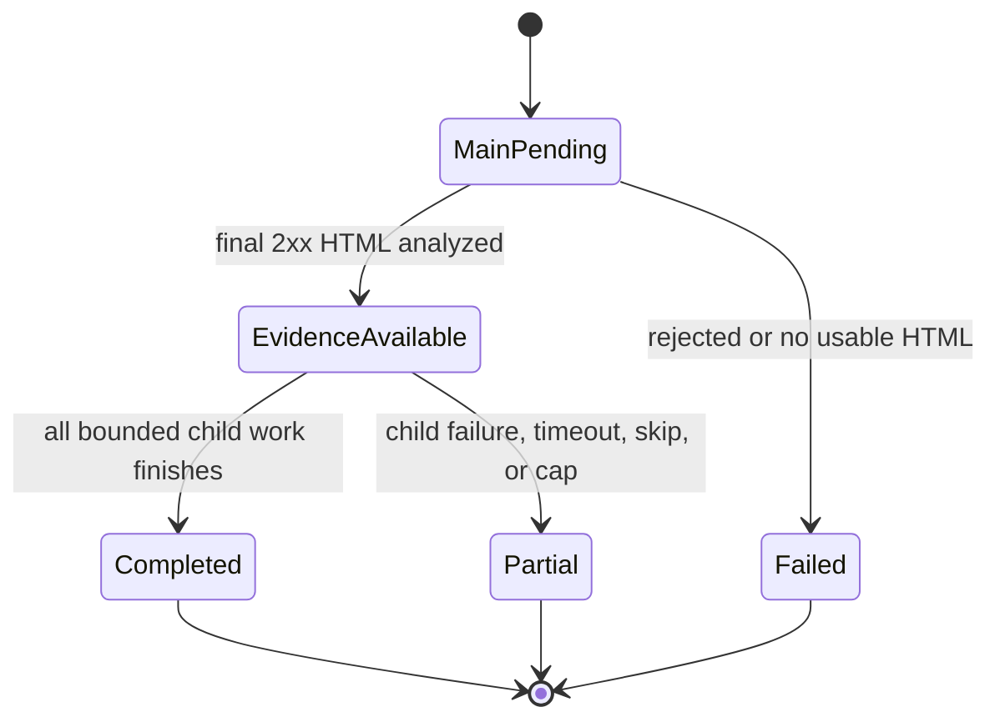

# Scanner v1 Public-Surface Analysis - Plan

## Goal Capsule

- **Objective:** A prospective client can submit a public website URL and receive a credible, conservative report about production-readiness signals observed in its public HTML and JavaScript.
- **Means:** Implement a deterministic, passive scanner with pinned-DNS HTTP transport and bounded static bundle discovery. (KTD1, KTD2)
- **Authority:** The user specification governs product scope. This plan governs implementation details. Current repository conventions govern formatting and integration.
- **Execution profile:** Deep, security-sensitive code work in `engisols-next` with test-first proof for transport and classification boundaries.
- **Stop conditions:** Stop if the implementation would execute target JavaScript, probe undiscovered routes or APIs, replay a credential, or require a product decision outside Scanner v1.
- **Tail ownership:** Verification includes scanner tests, lint, TypeScript checks, and a production build. Deployment WAF or rate limiting remains an external launch gate.

---

## Product Contract

### Summary

Scanner v1 accepts one public HTTP or HTTPS URL and inspects only the public artifacts obtained through ordinary, bounded GET requests. It returns deterministic findings, an observed-risk score, and explicit coverage metadata without testing whether a discovered credential works or whether Supabase RLS is correctly configured.

### Problem Frame

Modern Next.js, Nuxt, React, and Vue deployments split code across route-specific and lazy JavaScript chunks. Scanning only the first HTML response produces a weak report, while running the application or probing its APIs would exceed a passive lead magnet's safety boundary. The scanner therefore needs useful static breadth, strict SSRF defenses, and language that distinguishes evidence from proof.

### Requirements

**Input and passive-operation boundary**

- R1. Accept one syntactically valid public `http:` or `https:` URL through `POST /api/scan`.
- R2. Perform only passive GET requests for the submitted document, safe same-origin HTML routes already linked or advertised through standard public metadata, and discovered same-origin JavaScript assets.
- R3. Never execute target JavaScript, submit forms, click controls, construct framework prefetch requests, guess arbitrary or unadvertised application routes, call discovered APIs, replay credentials, or test authorization and RLS behavior.

**Network and resource safety**

- R4. Reject URL credentials, non-default ports, localhost names, and any literal or DNS-resolved non-public address before opening a target connection.
- R5. Validate every A and AAAA result and pin one validated address into the actual HTTP or HTTPS connection while preserving hostname, SNI, and certificate checks.
- R6. Reapply the complete URL, DNS, and IP policy to every redirect, with at most three redirects per request.
- R7. Enforce a four-second request timeout, twelve-second total scan timeout, one-MiB HTML limit, 256-KiB metadata limit, 1.5-MiB JavaScript limit, eight-MiB total decoded-content limit, sixteen-bundle fetch limit, 256-candidate discovery limit, two-metadata-document limit, two-route limit, depth-two bundle traversal, 64-KiB response-header cap, four-KiB API request-body cap, one-hundred-finding output cap, and four-scan per-instance concurrency ceiling.
- R8. Request identity encoding and safely bound wire and decoded sizes for gzip, deflate, or Brotli responses; skip unsupported or stacked encodings.

**Discovery and coverage**

- R9. Discover scripts from HTML script tags, module preload and script preload links, inline import maps, Next hydration metadata, directly referenced framework manifests, and literal Next or Nuxt asset references already present in the response.
- R10. Traverse only statically resolvable JavaScript import, export, dynamic-import, and `new URL` literals in deterministic breadth-first order.
- R11. Sample at most two queryless same-origin HTML routes already visible in a scanned document or advertised by `robots.txt` and its explicitly named same-origin sitemap. Exclude action-like, logout, delete, API, download, and resource paths.
- R12. Return bounded coverage facts for documents, bundles, bytes, redirect work, skipped assets, failures, truncations, and caps so that missing evidence is never presented as a clean result.

**Findings and report semantics**

- R13. Assign every finding exactly one classification: `by_design`, `needs_proof`, or `actually_bad`.
- R14. Detect the requested header, credential, Supabase, Stripe, OpenAI, private-key, table, route, webhook, and browser-to-Supabase signals using deterministic rules only.
- R15. Treat public Supabase anon or publishable keys and Stripe publishable keys as `by_design` with zero score deduction.
- R16. Treat structurally confirmed Supabase service-role or secret keys, Stripe secret or restricted keys, recognized OpenAI server secrets, complete private keys, and credential-bearing provider webhooks as `actually_bad`.
- R17. Treat administrative client routes, sensitive Supabase table references, generic hardcoded webhook endpoints, and missing security headers as `needs_proof`.
- R18. Describe direct browser-to-Supabase usage as `by_design`; state that authorization depends on RLS and that RLS was not tested.
- R19. Deduplicate evidence before applying fixed weights and per-category caps; `by_design` findings contribute zero risk.
- R20. Use conservative phrases such as “appears in a scanned public asset” and “not detected within scan coverage,” never “secure,” “credential active,” “data exposed,” or “RLS broken.”

**Sensitive data and API contract**

- R21. Convert raw credential matches immediately into safe family labels and internal fingerprints; never return source snippets, suffix characters, response bodies, resolved IPs, or raw secrets.
- R22. Strip credentials, queries, and fragments from every URL returned in a result or error.
- R23. Return a versioned typed `ScanResult` for successful or partially successful scans, including separate observed exposure, coverage confidence, production-proof checks, grouped findings, and recommendation. Return a separate versioned, sanitized error contract when no usable main HTML can be analyzed.
- R24. Keep all scanner business logic framework-independent under `engisols-next/src/scanner/`; the Next.js route performs only input decoding, capacity control, scanner invocation, and response mapping.

### Key Flows

- F1. Successful bounded scan
  - **Trigger:** The client posts a valid public URL.
  - **Steps:** Validate and fetch the main document, analyze headers and content, discover bounded routes and bundles, classify and deduplicate findings, score observed evidence, and serialize a redacted result.
  - **Outcome:** HTTP 200 with `status: "completed"` when all configured work finished or `status: "partial"` when child work was skipped or failed.
  - **Covered by:** R1-R24
- F2. Rejected or unusable target
  - **Trigger:** The request, destination, redirect, or main response violates the input or transport contract.
  - **Steps:** Stop before prohibited network access and map the internal failure to a stable public error code.
  - **Outcome:** A sanitized non-200 response with no network internals or remote body.
  - **Covered by:** R1, R4-R8, R21-R23
- F3. Sensitive match
  - **Trigger:** A high-confidence deterministic rule matches a server-side credential shape.
  - **Steps:** Fingerprint for deduplication, discard raw evidence, classify, score, and return only a family label and sanitized source.
  - **Outcome:** An `actually_bad` finding that does not claim the credential is active.
  - **Covered by:** R13-R16, R19-R23

### Acceptance Examples

- AE1. Given a Vite bundle with a Supabase publishable key and a Stripe `pk_live` key, when it is scanned, then both findings are `by_design`, their score deduction is zero, and no secret finding is produced. Covers R13, R15, R19.
- AE2. Given a Next page whose embedded bootstrap references a lazy bundle containing a Supabase service-role JWT, when the literal graph stays within limits, then the bundle is scanned and one redacted `actually_bad` finding is returned. Covers R9-R10, R16, R21.
- AE3. Given a hostname that resolves to both a public address and `127.0.0.1`, when the URL is submitted, then no target connection opens and the API returns a sanitized blocked-target error. Covers R4-R6, R23.
- AE4. Given usable main HTML and an oversized child bundle, when the bundle crosses its byte cap, then observed content remains reportable, the result is `partial`, and affected checks do not claim a pass. Covers R7, R12, R23.
- AE5. Given `.from("payments")` plus a confirmed Supabase browser client, when the corpus is analyzed, then the table finding is `needs_proof` and says RLS was not tested. Covers R17-R18, R20.

### Success Criteria

- Identical fixtures and a fixed clock produce the same findings, ordering, classifications, and score.
- The false-positive fixtures for legitimate public configuration produce no `actually_bad` findings.
- Transport tests prove that validation and connection use the same pinned address and that every redirect is revalidated.
- Serialized results and public errors contain none of the complete credential fixture values.
- The scanner produces useful coverage on ordinary Next.js, Nuxt, and Vite HTML without executing client code.

### Scope Boundaries

**In scope**

- Scanner library, endpoint, deterministic rules, scoring, redaction, bounded static discovery, test fixtures, and scanner-specific test tooling.

**Outside Scanner v1**

- Landing-page changes, repository upload, CRM, authentication, Meta tracking, email capture or delivery, Calendly, admin dashboard, source-map discovery, headless browsing, penetration testing, and RLS exploitation.
- The existing `engisols-next/app/scan/page.tsx` remains unchanged because its repository-upload and human-review promise does not match this API's product contract.

**Deployment prerequisite outside this change**

- Apply edge WAF or rate limiting before sending Meta ad traffic. The implementation adds body, concurrency, request, byte, bundle, redirect, and total-time limits but does not claim that per-instance controls replace edge abuse protection.

### Dependencies

- Node.js 20.9 or later, as required by the pinned Next.js version.
- No new runtime or test dependency. Scanner tests use TypeScript and the stable Node test runner already available under the supported Node baseline.

---

## Planning Contract

### Key Technical Decisions

- KTD1. **Use layered static discovery instead of a headless browser.** (session-settled: user-approved — chosen over executing target applications: static HTML, embedded bootstrap data, linked routes, and literal imports preserve the passive boundary while improving lazy-bundle coverage.) Implements R2-R3 and R9-R12.
- KTD2. **Use core Node HTTP with connection-time DNS pinning instead of validate-then-fetch.** A custom `lookup` binds each request to an already-approved address, and a per-scan hostname cache prevents later rebinding. Implements R4-R8.
- KTD3. **Reject any hostname with a mixed public and non-public DNS answer.** Rejecting the entire set is conservative and prevents address-selection ambiguity. Implements R4-R6.
- KTD4. **Scan only same-origin discovered routes and JavaScript.** Cross-origin assets are coverage skips in v1 because their ownership is ambiguous and following arbitrary origins would broaden the SSRF relay. Implements R2, R9-R12.
- KTD5. **Separate observed risk, coverage, and production proof.** Score only deduplicated observed findings. Report coverage confidence independently. Never use inverse observed risk as proof of production readiness. Implements R12-R13 and R19-R20.
- KTD6. **Use structural secret confirmation and immediate redaction.** Provider formats, decoded Supabase JWT roles, contextual OpenAI assignments, complete PEM blocks, and credential-bearing webhook shapes take precedence over broad entropy matching. Implements R14-R16 and R21.
- KTD7. **Add no dependencies.** Bounded parsers, IP policy, decompression, hashing, and tests use Node and TypeScript primitives to avoid runtime supply-chain additions. Implements R4-R10 and R24.
- KTD8. **Use evidence-led public metadata discovery with a bundle-time reserve.** Request `robots.txt` only when the initial document lacks enough safe routes. Follow only an explicitly advertised same-origin sitemap, stop when robots already supplies enough routes, cap the metadata phase, and preserve time for JavaScript analysis. Implements R2-R3 and R7-R12.

### High-Level Technical Design

These sketches define boundaries and information flow. They do not prescribe internal signatures.







### Proposed File Structure

```text
engisols-next/
├── app/api/scan/route.ts
├── src/scanner/
│   ├── discover-html.ts
│   ├── discover-js.ts
│   ├── discover-metadata.ts
│   ├── errors.ts
│   ├── framework-manifest.ts
│   ├── index.ts
│   ├── limits.ts
│   ├── public-fetch.ts
│   ├── public-metadata.ts
│   ├── redaction.ts
│   ├── rules.ts
│   ├── scan.ts
│   ├── scoring.ts
│   ├── assessment.ts
│   ├── types.ts
│   └── url-policy.ts
├── tests/scanner/
│   ├── fixtures/
│   │   ├── legitimate-public-config.ts
│   │   ├── dangerous-secrets.ts
│   │   └── framework-assets.ts
│   ├── discovery.test.ts
│   ├── public-fetch.test.ts
│   ├── rules.test.ts
│   ├── scan.test.ts
│   └── url-policy.test.ts
└── tsconfig.scanner-tests.json
```

### Proposed ScanResult TypeScript Contract

```ts
export type FindingClassification =
  | 'by_design'
  | 'needs_proof'
  | 'actually_bad'

export type FindingCategory =
  | 'security_headers'
  | 'credentials'
  | 'data_access'
  | 'admin_surface'
  | 'webhooks'
  | 'architecture'

export type CheckStatus = 'finding' | 'passed' | 'partial' | 'not_run'

export interface ScanFinding {
  id: string
  ruleId: string
  classification: FindingClassification
  category: FindingCategory
  title: string
  summary: string
  remediation: string
  evidence: {
    display: string
    sourceKind: 'headers' | 'html' | 'javascript'
    sourceUrl: string
  }
  riskPoints: number
}

export interface ScanCheck {
  id: string
  title: string
  status: CheckStatus
  findingIds: string[]
}

export interface ScanCoverage {
  scope: 'bounded_public_surface'
  completeness: 'complete' | 'partial'
  documents: { discovered: number; attempted: number; scanned: number }
  metadata: { discovered: number; attempted: number; scanned: number }
  scripts: { discovered: number; attempted: number; scanned: number }
  bytesScanned: number
  redirectsFollowed: number
  skipped: Array<{ reason: string; count: number }>
  limitsReached: string[]
}

export interface ScanResult {
  schemaVersion: 'scanner-v1'
  status: 'completed' | 'partial'
  target: {
    requestedUrl: string
    finalUrl: string
    httpStatus: number
  }
  score: {
    modelVersion: 'scanner-v1'
    risk: number
    readiness: number
    band: 'low' | 'moderate' | 'high' | 'critical'
    categoryDeductions: Record<FindingCategory, number>
  }
  assessment: {
    modelVersion: 'scanner-v1.1'
    exposure: { risk: number; band: string; actuallyBad: number }
    coverage: {
      confidence: 'limited' | 'partial' | 'strong'
      score: number
      reasons: string[]
    }
    productionProof: {
      scope: 'public_surface_only'
      checks: ProductionProofCheck[]
    }
    recommendation: 'monitor' | 'code_review' | 'urgent_review'
    headline: string
    groups: ScanFindingGroup[]
  }
  summary: {
    total: number
    byDesign: number
    needsProof: number
    actuallyBad: number
  }
  findings: ScanFinding[]
  checks: ScanCheck[]
  coverage: ScanCoverage
  limitations: string[]
  durationMs: number
}

export type ScanApiResponse =
  | { ok: true; result: ScanResult }
  | {
      ok: false
      error: {
        schemaVersion: 'scanner-v1'
        code:
          | 'invalid_request'
          | 'target_blocked'
          | 'target_unavailable'
          | 'scan_capacity_reached'
        message: string
      }
    }
```

URLs in this contract are sanitized. Credential fingerprints remain internal because the browser does not need a reusable secret correlation handle.
Finding IDs are assigned after deterministic sorting and never derive from raw secret material.

### Rule Matrix

| Rule ID | Deterministic evidence | Classification | Risk points | Category cap | Guardrail |
|---|---|---:|---:|---:|---|
| `header.csp_missing` | No enforcing CSP on final HTML | `needs_proof` | 8 | Headers 20 | Report-only CSP does not satisfy the rule |
| `header.frame_protection_missing` | Neither CSP `frame-ancestors` nor X-Frame-Options | `needs_proof` | 4 | Headers 20 | Presence check only; no strength claim |
| `header.nosniff_missing` | X-Content-Type-Options is not `nosniff` | `needs_proof` | 4 | Headers 20 | Final HTML only |
| `header.referrer_policy_missing` | Referrer-Policy absent | `needs_proof` | 2 | Headers 20 | Final HTML only |
| `header.permissions_policy_missing` | Permissions-Policy absent | `needs_proof` | 2 | Headers 20 | Final HTML only |
| `header.hsts_missing` | HTTPS final response lacks HSTS | `needs_proof` | 4 | Headers 20 | Not applicable to HTTP |
| `supabase.publishable_key` | `sb_publishable_*` or structurally confirmed anon JWT | `by_design` | 0 | Credentials 70 | Never label as a secret |
| `supabase.secret_key` | `sb_secret_*` or structurally confirmed service-role JWT | `actually_bad` | 60 | Credentials 70 | Decode locally; never validate online |
| `stripe.publishable_key` | Full `pk_test_*` or `pk_live_*` shape | `by_design` | 0 | Credentials 70 | Suppress placeholders and docs samples |
| `stripe.secret_key` | Full `sk_*` or `rk_*` shape | `actually_bad` | 45 | Credentials 70 | Test keys remain server-side credentials |
| `openai.server_secret` | Recognized full format or high-entropy value in explicit OpenAI key context | `actually_bad` | 50 | Credentials 70 | A variable name or `sk-` prefix alone is insufficient |
| `credential.private_key` | Complete recognized PEM begin, body, and end | `actually_bad` | 60 | Credentials 70 | Marker-only text is ignored |
| `supabase.table_reference` | Literal `.from("table")` with corpus-level Supabase context | `needs_proof` | 4 | Data access 18 | Never claim exposure or broken RLS |
| `supabase.sensitive_table` | Confirmed table reference with a sensitive name | `needs_proof` | 10 | Data access 18 | Literal calls only; deduplicate table names |
| `route.admin_surface` | Parsed anchor or path literal for an administrative client route | `needs_proof` | 8 | Admin surface 8 | Detect but never probe |
| `webhook.credential_bearing` | Full provider-specific Slack, Discord, or equivalent capability URL | `actually_bad` | 35 | Webhooks 35 | Never call the URL |
| `webhook.generic_hardcoded` | Hardcoded HTTP endpoint with a webhook path and no known credential shape | `needs_proof` | 8 | Webhooks 35 | Do not classify generic paths as compromised |
| `architecture.browser_supabase` | Supabase client creation or SDK evidence plus URL or public key | `by_design` | 0 | Architecture 8 | State that authorization depends on untested RLS |

Risk is the sum of deduplicated rule points after category caps, capped at 100. The legacy compatibility field `readiness` is `100 - risk`; it is not a production-readiness claim. Bands are low `0-10`, moderate `11-30`, high `31-60`, and critical `61-100`. The v1.1 assessment reports exposure, coverage confidence, and unverified production controls separately.

### Implementation Constraints

- Use single quotes, no semicolons, two-space indentation, trailing commas, and descriptive invariant comments in scanner code.
- Inject DNS, single-request transport, fingerprint-key, and clock dependencies so unit tests use no live network and can produce stable results.
- Keep sensitive raw values inside the shortest possible matching scope and exclude source snippets from public findings.
- Sort candidate URLs and findings before traversal and serialization when document order does not own priority.
- Treat a final 2xx HTML-compatible response as the minimum evidence for a `ScanResult`; otherwise return a sanitized error.

### Risks and Mitigations

- **DNS rebinding or alternative IP notation:** Canonicalize through WHATWG URL parsing, validate all answers, unwrap mapped IPv6, and pin the approved address into the socket.
- **Decompression bombs and slow responses:** Enforce wire, decoded, request, and scan-wide limits with abort-driven teardown.
- **False-positive secrets:** Require full provider structures, local Supabase role decoding, placeholder suppression, and legitimate-public-config fixtures.
- **Incomplete lazy bundles:** Use two linked routes and depth-two literal traversal, then expose caps and skips instead of claiming completeness.
- **Third-party attribution:** Skip cross-origin scripts and report them in coverage.
- **Public endpoint abuse:** Add a small per-instance concurrency ceiling and require deployment edge limiting before promotion.

### Sources

- `engisols-next/AGENTS.md` and `engisols-next/SESSION-HANDOFF.md` for local Next.js and style constraints.
- [OWASP SSRF Prevention Cheat Sheet](https://cheatsheetseries.owasp.org/cheatsheets/Server_Side_Request_Forgery_Prevention_Cheat_Sheet.html) for redirect, DNS, and address-validation risks.
- [Node.js 20 HTTP](https://nodejs.org/download/release/latest-v20.x/docs/api/http.html), [HTTPS](https://nodejs.org/download/release/latest-v20.x/docs/api/https.html), [DNS](https://nodejs.org/download/release/latest-v20.x/docs/api/dns.html), and [AbortSignal](https://nodejs.org/download/release/latest-v20.x/docs/api/globals.html) for pinned transport and deadlines.
- [IANA IPv4](https://www.iana.org/assignments/iana-ipv4-special-registry) and [IPv6 special-purpose registries](https://www.iana.org/assignments/iana-ipv6-special-registry) for non-public address policy.
- [Next.js Route Handlers](https://nextjs.org/docs/app/api-reference/file-conventions/route) and [Server and Client Components](https://nextjs.org/docs/app/getting-started/server-and-client-components) for endpoint and embedded client-reference behavior.
- [Vite backend integration](https://vite.dev/guide/backend-integration) for manifest import and dynamic-import relationships.
- [Supabase API keys](https://supabase.com/docs/guides/getting-started/api-keys), [Stripe keys](https://docs.stripe.com/keys), and [OpenAI quickstart](https://platform.openai.com/docs/quickstart) for public versus server-side credential semantics.
- [MDN Content Security Policy](https://developer.mozilla.org/en-US/docs/Web/HTTP/Guides/CSP) and [OWASP HTTP Headers](https://cheatsheetseries.owasp.org/cheatsheets/HTTP_Headers_Cheat_Sheet.html) for conservative header checks.

---

## Implementation Units

### U1. Contract, limits, errors, and zero-dependency test harness

- **Goal:** Establish the stable public types and all hard limits before feature logic.
- **Requirements:** R7, R12-R13, R19-R24; KTD5, KTD7.
- **Files:** `engisols-next/src/scanner/types.ts`, `engisols-next/src/scanner/limits.ts`, `engisols-next/src/scanner/errors.ts`, `engisols-next/tsconfig.scanner-tests.json`, `engisols-next/package.json`, `engisols-next/.gitignore`.
- **Approach:** Define literal unions and version markers, immutable default limits, sanitized scanner errors, a dedicated test compilation target, and `test:scanner` scripts that run compiled tests with `node --test`.
- **Execution note:** Write contract and limit tests before downstream modules consume the types.
- **Test scenarios:** Assert schema literals and score categories compile; verify custom limits cannot exceed safe hard ceilings; verify public errors contain no internal cause, URL query, or IP data.
- **Verification:** Run scanner contract tests and TypeScript compilation.

### U2. URL policy and pinned outbound transport

- **Goal:** Make every network request enforce the same SSRF and resource-safety contract at connection time.
- **Requirements:** R1, R4-R8, R21-R23; KTD2, KTD3, KTD7.
- **Files:** `engisols-next/src/scanner/url-policy.ts`, `engisols-next/src/scanner/public-fetch.ts`, `engisols-next/tests/scanner/url-policy.test.ts`, `engisols-next/tests/scanner/public-fetch.test.ts`.
- **Approach:** Parse and sanitize URLs, reject special-purpose IPv4 and IPv6, resolve all records with a deadline, pin the selected address through core HTTP or HTTPS, follow redirects manually, decode supported encodings with dual caps, and expose sanitized typed failures.
- **Execution note:** Prove URL and DNS rejection before adding live transport behavior.
- **Test scenarios:** Cover decimal and hexadecimal loopback, shortened IPv4, mapped IPv6, mixed DNS answers, rebinding attempts, redirect-to-private, redirect loops, fourth redirect, non-default ports, TLS hostname preservation, lying content length, chunked oversize, compressed oversize, slow DNS, slow body, and unsupported encodings.
- **Verification:** Run U2 tests with fake resolver and transport only; inspect that the approved address is the one supplied to the connection lookup.

### U3. Bounded HTML, route, and JavaScript discovery

- **Goal:** Reach useful route-specific and lazy assets without executing the application or broadening the crawl.
- **Requirements:** R2-R3, R7, R9-R12; KTD1, KTD4.
- **Files:** `engisols-next/src/scanner/discover-html.ts`, `engisols-next/src/scanner/discover-js.ts`, `engisols-next/src/scanner/discover-metadata.ts`, `engisols-next/src/scanner/framework-manifest.ts`, `engisols-next/src/scanner/public-metadata.ts`, `engisols-next/tests/scanner/discovery.test.ts`, `engisols-next/tests/scanner/metadata-discovery.test.ts`, `engisols-next/tests/scanner/fixtures/framework-assets.ts`.
- **Approach:** Extract supported HTML relationships and import maps, select safe linked routes deterministically, traverse same-origin literal bundle references breadth-first to depth two, and record every rejected or capped candidate by reason.
- **Execution note:** Add framework-shaped fixtures before integrating discovery with transport.
- **Test scenarios:** Cover Next embedded asset references, Nuxt asset paths, Vite module preload and import maps, static and dynamic imports, `new URL`, cycles, nonliteral imports, cross-origin scripts, unsafe route links, deterministic route selection, bundle count, graph depth, and byte caps.
- **Verification:** Run discovery tests twice and compare stable traversal and coverage ordering.

### U4. Deterministic rules and immediate redaction

- **Goal:** Produce useful findings while protecting public configuration from secret misclassification.
- **Requirements:** R13-R18, R20-R22; KTD6.
- **Files:** `engisols-next/src/scanner/redaction.ts`, `engisols-next/src/scanner/rules.ts`, `engisols-next/tests/scanner/rules.test.ts`, `engisols-next/tests/scanner/fixtures/legitimate-public-config.ts`, `engisols-next/tests/scanner/fixtures/dangerous-secrets.ts`.
- **Approach:** Implement the rule matrix as named deterministic evaluators, use corpus-level Supabase context, suppress placeholders and incomplete formats, discard raw matches immediately, and deduplicate with internal fingerprints.
- **Execution note:** Begin with false-positive fixtures for Supabase anon or publishable and Stripe publishable values, then add dangerous fixtures.
- **Test scenarios:** Verify every matrix row, malformed JWTs, docs samples, environment-variable names, marker-only private keys, `.from(variable)`, `.from("payments")` with and without Supabase context, prose containing “administrator,” report-only CSP, HTTP without HSTS, duplicate secrets across chunks, and absence of every full secret from serialized output and thrown errors.
- **Verification:** Run U4 tests and search test output and snapshots for complete fixture credentials.

### U5. Scoring and scan orchestration

- **Goal:** Combine fetch, discovery, rules, scoring, checks, and coverage into one stable framework-independent result.
- **Requirements:** R7, R12-R14, R19-R23; KTD1, KTD5.
- **Files:** `engisols-next/src/scanner/scoring.ts`, `engisols-next/src/scanner/assessment.ts`, `engisols-next/src/scanner/scan.ts`, `engisols-next/src/scanner/index.ts`, `engisols-next/tests/scanner/assessment.test.ts`, `engisols-next/tests/scanner/scan.test.ts`.
- **Approach:** Analyze the main document first, continue bounded child work after recoverable failures, derive check states from actual coverage, deduplicate before category caps, sort findings deterministically, and inject time and network dependencies.
- **Execution note:** Assemble with fixture transports before exposing the Next route.
- **Test scenarios:** Cover full bounded completion, partial route or bundle failures, total timeout after main evidence, total timeout before main evidence, score caps, zero-risk public config, stable repeated results with a fixed clock, and `not_run` or `partial` checks when evidence is unavailable.
- **Verification:** Run the complete scanner test suite with no external network.

### U6. Next.js API adapter and capacity guard

- **Goal:** Expose Scanner v1 as a small, sanitized Node runtime route without coupling scanner logic to Next.js.
- **Requirements:** R1, R7, R21-R24.
- **Files:** `engisols-next/app/api/scan/route.ts`, `engisols-next/tests/scanner/route.test.ts` if route logic needs a separately exported decoder.
- **Approach:** Export the Node runtime and a platform duration above the scanner deadline, stream-read a small JSON body, validate the exact `{ url }` shape, enforce a per-instance concurrency ceiling, map scanner errors to stable statuses, and set `Cache-Control: no-store`.
- **Test scenarios:** Cover valid input, malformed JSON, oversized body, missing or extra fields, blocked target, unavailable target, saturated concurrency, sanitized failures, and no-store headers.
- **Verification:** Run route-level tests, lint, TypeScript checks, and the Next production build.

### U7. Integrated verification and handoff evidence

- **Goal:** Demonstrate that Scanner v1 is safe, bounded, deterministic, and isolated from deferred product work.
- **Requirements:** R1-R24.
- **Files:** All Scanner v1 files and the final diff.
- **Approach:** Run every quality gate, inspect the diff for scope creep and secret leakage, and generate one example result from fixture data.
- **Test scenarios:** Exercise the acceptance examples end to end with fake DNS and transport; confirm the existing scan page is unchanged; confirm no credential fixture appears in produced JSON.
- **Verification:** Run all commands in the Verification Contract and perform a security-focused code review before handoff.

---

## Verification Contract

| Gate | Command | Proves |
|---|---|---|
| Scanner tests | `cd engisols-next && npm run test:scanner` | URL policy, pinned transport, discovery, rule boundaries, redaction, scoring, orchestration, and API decoding |
| Lint | `cd engisols-next && npm run lint` | Repository lint conventions and common correctness issues |
| TypeScript | `cd engisols-next && npx tsc --noEmit` | App and scanner contract compatibility |
| Production build | `cd engisols-next && npm run build` | Next.js 16 route integration and production compilation |
| Scope review | `git diff --check && git status --short` | Clean patch formatting and no generated test output or unrelated page changes |
| Secret-leak review | Search produced fixture JSON for each full credential fixture | No raw credential reaches public output |

Tests must not use the public internet. Any optional smoke scan against a user-controlled public fixture is manual, occurs after unit proof, and must not replace deterministic transport tests.

---

## Definition of Done

- U1-U7 satisfy their listed requirements and test scenarios.
- `POST /api/scan` returns the versioned success or error union and always sets `Cache-Control: no-store`.
- Every outbound request passes URL, DNS, IP, redirect, deadline, and byte-budget enforcement before content analysis.
- Public Supabase and Stripe fixtures remain `by_design`; high-confidence server credentials remain `actually_bad`; ambiguous architecture and surface signals remain conservative.
- No returned finding, error, URL, test snapshot, or application log contains a complete matched credential, URL credentials, query string, resolved IP, or upstream response body.
- Coverage remains explicitly bounded, and incomplete work is never presented as complete or as proof of production readiness.
- Scanner tests, lint, TypeScript, production build, diff checks, and the final security review pass.
- The existing landing page, CRM, authentication, tracking, email, Calendly, and admin surfaces are unchanged.
- Generated test output and abandoned experimental code are removed from the final diff.
