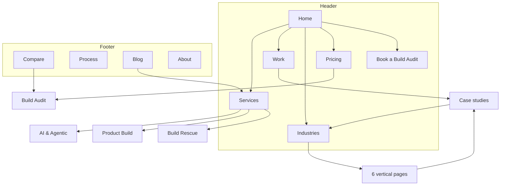

# Engisols.com Redesign Plan
**Prepared for:** Hamza
**Date:** 1 September 2026
**Status:** Draft for review. Nothing gets built until you approve section 14.

---

## 1. What I could and couldn't check

**Could check.** The HTML shell, meta layer, and positioning copy at engisols.com. Findings:

| Item | Current value | Problem |
|---|---|---|
| Title | "ENGISOLS \| Your Engineering Vanguard" | "Vanguard" is a word, not a claim. Nothing a buyer can act on. |
| Meta description | "ENGISOLS builds modern web, mobile, and cloud products for startups and enterprises. Scalable engineering, on-time delivery, transparent pricing." | Interchangeable with 500 other agencies. "Startups and enterprises" means no one. |
| Theme colour | `#0e0e0e` | Confirms the dark-flat direction you're calling dull. |
| Render | Client-side only. Body is a `noscript` fallback. | Googlebot handles this, most AI crawlers and LLM answer engines handle it badly. You are likely invisible to ChatGPT, Perplexity, and Google AI Overviews. This is a real revenue leak, not a nitpick. |

**Couldn't check.** The rendered page. The fetch returned only the JS fallback, so I have not seen your current sections, spacing, or imagery. **Send me 3 full-page screenshots (desktop home, mobile home, one inner page) before the call** and I will mark up exactly what dies and what survives.

---

## 2. The real diagnosis

The site is dull because of the palette, but it fails because of three structural things that no amount of animation fixes.

**a) It sells a category, not a decision.** "Modern web, mobile, and cloud products" is what the buyer already knows they want. It answers nothing about why you.

**b) It has no numbers.** From the agency research: a serious dev-agency site leads with case studies, and when a prospect lands on an agency site with no numbers, they read the silence as an answer. Your actual assets (40+ shipped products, three seniors with 9 years each, AWS SA certified, no juniors, no account managers) are not on the page in a form anyone can verify.

**c) It hides the one thing US/UK/AU buyers screen for first: price and working model.** Cogent Labs, in your own city and your own cost base, puts `Free / $3,000 / $15K–$75K` on the homepage with "who it's for" under each. That single decision does more conversion work than every animation in this document combined.

**Motion is the amplifier. Positioning is the signal. We fix the signal first, then amplify it.**

Working positioning line to react to on the call:

> **Three senior engineers. No juniors, no account managers, no handoffs. We ship AI-native software for teams whose last build stalled.**

---

## 3. Design direction

**Palette: locked by Hamza, 1 Sept 2026.** Warm five-value scheme. Hero opens dark.

**Concept: the practice.** Warm, considered, expensive. Closer to a private members club or a law firm than a dev shop, and nobody in the competitive set looks remotely like this. The signal is "three senior engineers who charge senior rates," not "software house."

### Base tokens

Sampled from the reference image, then corrected for production (the photo carries a warm shadow cast that muddies the raw pixels).

```
--vanilla    #F0E7DB   primary light ground        (sampled #eee2d4)
--oat        #DCCDBB   secondary light ground      (sampled #d7c6b5)
--greige     #B3A091   mid ground, borders, rules  (sampled #b09d8f)
--cherry     #8E2430   brand red, full-bleed panels, CTAs, links (sampled #471d1f)
--bordeaux   #43212A   hero, footer, body type on light (sampled #32191d, shipped darker at #2A1418 and later lifted)
```

**Cherry Velvet was pushed significantly brighter than sampled.** At `#471d1f` it sits 1.13 against Bordeaux Noir, meaning the two darks were the same colour to the eye. At `#8E2430` it separates enough to hold its own job.

### Measured contrast (computed, not eyeballed)

| Pair | Ratio | Verdict |
|---|---|---|
| bordeaux on vanilla (body text) | 11.52 | Pass |
| bordeaux on oat | 9.06 | Pass |
| bordeaux on greige | 5.61 | Pass |
| cherry on vanilla (links) | 7.02 | Pass |
| cherry on oat | 5.52 | Pass |
| cherry on greige | 3.42 | Large text only |
| vanilla on bordeaux (dark hero) | 11.52 | Pass |
| oat on bordeaux | 9.06 | Pass |
| greige on bordeaux (muted) | 5.61 | Pass |
| vanilla on cherry | 7.02 | Pass |
| vanilla vs oat | 1.27 | **Barely separable** |
| oat vs greige | 1.62 | **Barely separable** |
| greige on vanilla | 2.05 | **Surface only, never text** |
| cherry vs bordeaux | 1.64 | **Not separable at text size** |

### The three structural facts this palette forces

**1. It is a three-tier palette, not a five-colour one.** Vanilla and Oat are 1.27 apart, Cherry and Bordeaux are 1.64 apart. The real tiers are light, mid, and dark. Treat Oat as a *quiet variation* on Vanilla for alternating sections, never as a contrast device. Nothing structural should depend on a reader noticing the difference.

**2. Cherry and Bordeaux are indistinguishable at text size but distinguishable at full-bleed scale.** Across a whole screen the hue difference reads clearly; at 16px it does not. So Cherry gets exactly two jobs: full-bleed panels (section 7) and filled CTAs. Bordeaux gets the hero, the footer, and all body type on light grounds.

**3. Links cannot be signalled by colour alone.** No red in this family clears both AA on Vanilla and clear separation from Bordeaux body text. Best available trade is `#8E2430` at 7.02 on Vanilla but only 1.64 against Bordeaux. **Every inline link therefore carries a persistent underline or bottom rule.** This is also the correct accessibility behaviour under WCAG 1.4.1, so the constraint and the standard agree.

### Section rhythm

Dark hero, dark footer, light body. The arc is dark → light → mid → dark → light → mid → dark.

| Section | Ground |
|---|---|
| 1 Hero | bordeaux |
| 2 Trust strip | bordeaux (hairline greige divider, same block) |
| 3 The stall | **vanilla** ← hardest cut on the page |
| 4 Proof band | oat |
| 5 Services | vanilla |
| 6 Selected work | greige |
| 7 Capability grid | **cherry**, full bleed |
| 8 How we work | vanilla |
| 9 The three of you | oat |
| 10 Pricing | vanilla |
| 11 Scope estimator | greige |
| 12 Footer | bordeaux |

Three dark moments only. If a fourth gets added during build, one has to come out.

### Type

The palette is soft, warm, and luxurious. Typography is what stops it reading as a skincare brand. Set it hard and technical.

| Role | Pick | Alternate | Notes |
|---|---|---|---|
| Display | Uncut Sans | General Sans | **No serif display.** Serif plus this palette is a candle company. Grotesque only, weight 500 to 600, tight tracking, clamp 56px to 112px. |
| Body | Inter Tight | Switzer | Max 68 characters per line. |
| Mono | Geist Mono | JetBrains Mono | Real machine data only: latency figures, stack tags, deploy timestamps. Used more here than usual, because it is load-bearing evidence that this is an engineering firm. |

Avoid the generic tells: all-caps eyebrow labels above every heading, one word in the headline coloured differently, `01 / 02 / 03` markers on anything that is not genuinely a sequence, `→` glued to every button.

### Layout

Left-aligned, single strong column with a wide right-hand gutter for status marks and metadata. Not centred. Centred serif copy on cream is the exact composition this palette is normally used for, and it is the thing to avoid.

### The strategic risk, stated plainly

**Cream, oat, greige and burgundy is a beauty and interiors colour story.** It is the Summer Fridays palette, it is the Pinterest interior board palette, and a US or UK founder landing on it will read "brand studio" or "skincare" before they read "engineering firm" unless something else corrects them fast.

That correction has to come from three places, and none is optional:

1. **Typography set hard.** Grotesque, tight, large. No serif, no letterspaced small caps, no delicate hairline rules.
2. **Content density.** Real numbers, stack names, latency figures, timestamps, code. The page should look like it was written by engineers who happen to have taste.
3. **The dark hero.** Opening on Bordeaux Noir is what saves this. Beauty brands almost always open light and airy. Opening dark and warm reads as a members club, not a serum.

Get those three right and this palette is a genuine competitive moat, because no engineering agency looks like this. Get them wrong and it is a candle company that writes Python.

---

## 4. Motion system

This is the part that makes the animations feel "in flow" instead of feeling like a demo reel. Every effect on this site obeys the same four rules.

**Rule 1: one scene per viewport.** At any scroll position, exactly one scroll-linked animation is running. Two competing scrubbed animations is what makes a site feel cheap.

**Rule 2: one shared physics.** Everything uses these three curves and nothing else:

```js
const EASE = {
  enter:  [0.22, 1, 0.36, 1],           // entrances, 320–420ms
  micro:  [0.4, 0, 0.2, 1],             // hover, focus, toggles, 120–180ms
  spring: { stiffness: 220, damping: 30, mass: 0.8 }  // pointer + drag only
}
```

**Rule 3: small distances.** Translate maximums of 8, 16, or 24px. Never 60px slide-ups. Stagger is 40ms per item, capped at 8 items.

**Rule 4: reduced motion is a real branch, not a disable.** Under `prefers-reduced-motion`, every scroll scene collapses to an opacity fade at final position. Custom cursors switch off entirely. Test it before shipping.

**Framework decision.** Build in React (Next.js App Router), which matches your stack. Every Vue URL you sent has a React twin, so the Vue list adds nothing except duplicates. Import through `LazyMotion` with `domAnimation` and dynamic-import every below-fold scene.

---

## 5. Homepage architecture

Twelve sections. The order is a deliberate argument: hook, agitate, prove, explain, price, remove risk, close.

| # | Section | Job | Signature motion |
|---|---|---|---|
| 1 | **Hero** | Say who it's for and what happens | Scroll Zoom Hero + Split Text (once) |
| 2 | **Trust strip** | Borrow credibility in 2 seconds | Ticker (logos, markets, certifications) |
| 3 | **The stall** | Name the pain in their words | Scroll Text Lines |
| 4 | **Proof band** (dark) | Numbers, not adjectives | Line Graph + counters, viewport-tracked |
| 5 | **Services** | What you can buy | Smooth Tabs |
| 6 | **Selected work** | Evidence with figures | Horizontal Scroll Gallery + Cursor Image Hover |
| 7 | **Capability grid** | Show engineering range, and show off | Pointer Collision Detection |
| 8 | **How we work** | Kill the offshore risk objection | Scroll Highlight (sticky step nav) |
| 9 | **The three of you** | The actual differentiator | Scroll Image Reveal |
| 10 | **Pricing and engagements** | Let them self-qualify | Smooth Tabs (shared component) |
| 11 | **Scope estimator** | Capture intent, not just email | Create Button → Conditional Field → Dots Morph → Toast |
| 12 | **Footer** | Close and interlink | Footer Reveal |

### Section notes worth arguing about on the call

**1. Hero.** Do not use a stock 3D blob. The zoom-hero background is a montage of *your actual shipped product UIs*. Headline animates with Split Text exactly once, word-level, 40ms stagger. Two CTAs: the paid diagnostic (primary) and "See the work" (secondary). Add a live capacity line in mono: `Next build slot: [month]. 2 of 3 engineers allocated.` Real scarcity from a real 3-person shop is honest and it converts.

**4. Proof band.** Only animate a graph if you have a real number behind it. An animated line chart with invented data is the fastest way to lose a technical buyer. If you don't have a defensible metric yet, replace the graph with three verified figures and cut the line-graph animation entirely.

**7. Capability grid.** This is your one show-off moment. Pointer collision detection on a grid of stack tags (FastAPI, LangGraph, pgvector, Rails, Go, n8n, Ollama) is memorable, it is genuinely hard to build, and it silently proves you can do frontend engineering. Spend the boldness here and keep everything around it quiet.

**8. How we work.** This section is where the deal is actually won for offshore-to-US/UK/AU. It must cover: timezone overlap hours, who you talk to (a named engineer, not a PM), IP assignment, NDA, code ownership and repo access from day one, and what happens if you go quiet. Nobody else in your market writes this down.

**11. Scope estimator.** Three questions maximum: what stage is your build, what is the timeline, what is the budget band. Conditional fields expand only when relevant. This qualifies leads before a call and it beats a contact form by a wide margin.

---

## 6. Full animation map

All 34 URLs you sent, deduplicated to 26 unique effects. Verdict column is my recommendation.

### Keep and place

| Motion example | What it does | Where it goes |
|---|---|---|
| `scroll-zoom-hero` | Background scales, blurs, fades on scroll | Hero, section 1 |
| `split-text` | Word/character stagger in | Hero headline only. Once per page. |
| `scroll-hide-header` | Header hides down, returns up | Global header |
| `mega-menu` | Animated multi-column nav | Header, Services and Industries columns |
| `scroll-text-lines` | Line-by-line reveal on scroll | Section 3, the stall |
| `text-scroll-word-reveal` | Word-by-word reveal tied to scroll | Section 9 opener only |
| `scroll-track-element-in-viewport` | Tracks element progress through viewport | Drives counters in section 4 |
| `line-graph` | Animated path drawing | Section 4, **only with real data** |
| `smooth-tabs` | Animated tab indicator, content crossfade | Sections 5 and 10 (one component, reused) |
| `scroll-horizontal` | Vertical scroll drives horizontal gallery | Section 6, selected work |
| `cursor-hover-follow` | Image preview follows cursor on hover | Section 6 and `/work` index |
| `collision-hover-grid` | Grid reacts to pointer proximity | Section 7, capability grid |
| `scroll-highlight` | Active section highlights in sticky nav | Section 8, process steps |
| `scroll-image-reveal` | Clip-path image reveal on scroll | Section 9, team |
| `create-button` | Button expands into a form | Section 11, opens the estimator |
| `clerk-conditional-field` | Field appears with height animation | Section 11, conditional questions |
| `dots-morph-button` | Button dots morph into loading state | Section 11, submit |
| `base-toast` | Toast notification | Form success and error |
| `sheet-modal` | Bottom sheet | Mobile: case study quick view, booking |
| `ios-pointer` | Pointer snaps and morphs to targets | Global cursor, desktop with fine pointer only |
| `footer-reveal` | Footer revealed under the page | Section 12 |
| `curtains-fade` | Curtain transition | Route changes. **Implement with native View Transitions, not JS.** See note below. |

### Cut or demote, with reasons

| Motion example | Verdict | Why |
|---|---|---|
| `curtains-blinds` | **Cut from global use** | A blinds curtain on every route gets tiring by the third click. Optional: use it once, only on the transition from `/work` into a case study, where it reads as opening a project. |
| `cursor` (adaptive caret) | **Cut** | Third pointer system in the list. `ios-pointer` plus `cursor-hover-follow` already covers global and contextual. Three cursor behaviours on one site is noise. |
| `scroll-velocity-linked-offset` (3D planes) | **Cut from homepage** | Decorative, GPU-expensive, and it competes with the horizontal gallery for the same job. Optional on `/work` at low intensity if you want one extra flourish there. |
| `confetti` | **Cut** | Reads consumer-app. A CTO in Austin submitting a $60K scope request does not want confetti. The toast is the correct confirmation. |
| All Vue duplicates | **Cut** | React equivalents exist for every one. Do not mix frameworks. |

**Motion budget for the homepage: 8 scroll-linked scenes maximum.** The map above is at 8. Anything else you want to add has to replace something.

### Note: page transitions survive the no-SPA decision

The one animation the rendering decision touches is the route transition. It does not need a client-side router any more.

```css
@view-transition { navigation: auto; }
```

That single at-rule, present on both the outgoing and incoming page, gives native cross-document transitions. Support as of 2026: Chromium 126+ and Safari 18.2+. Firefox has not shipped cross-document yet, so treat it as progressive enhancement. Browsers without support simply navigate the normal way, and nothing breaks, so no fallback code is needed.

Everything else in the map is a per-page scroll or pointer effect and is completely unaffected by how navigation works.

Use Motion's MotionScore on each example page and keep everything at grade S or A. Reject anything below B.

---

## 7. Sections your competitors have that you don't

From the teardown of Cogent Labs (Lahore, same cost base, direct competitor) and the wider agency research:

1. **A priced offer ladder on the homepage.** Cogent: `Free community → $3,000 audit (14 days, fixed) → $15K–$75K build`, each with "who it's for." You have none of this. **Highest-impact single addition on this list.**
2. **A paid diagnostic as the front door.** Their $3,000 AI Audit with a money-back guarantee. This turns a cold visitor into a paying client at low risk. It matches the funnel you already said you want to replicate.
3. **Case studies with figures.** Named client, industry, before/after number.
4. **Founder story with a face and a specific claim.** Theirs is "87 employees to 58, same output." Yours is three seniors shipping what most 15-person shops ship.
5. **Vertical case study pages.** Their footer links out to healthcare, retail, SaaS, construction, logistics, legal, hospitality. That is an internal-linking and SEO play. Your verticals (real estate, healthcare, legal tech, CRM, construction, payroll) map directly.
6. **Testimonials placed inside evaluation sections**, not dumped in one strip at the bottom. Put the proof where the doubt is.
7. **Guarantee language.** "Prioritised roadmap or your money back." Removes the biggest offshore objection.
8. **A newsletter or community as the low-commitment capture.** Not everyone is ready to buy.
9. **A shipping log or changelog.** Public evidence of velocity. Very few agencies do this, and it is nearly free for you.
10. **An interactive artifact.** Research is consistent: letting a visitor experience something beats telling them. Your scope estimator is this.

---

## 8. Site architecture

```
Home (/)
├── Services (/services)
│   ├── AI & Agentic Systems (/services/ai-engineering)
│   ├── MVP & Product Build (/services/product-build)
│   ├── Build Rescue (/services/build-rescue)
│   ├── Automation & Integrations (/services/automation)
│   └── Cloud & DevOps (/services/cloud-devops)
├── Work (/work)
│   └── Case study (/work/{slug})
├── Industries (/industries)
│   ├── Real estate (/industries/real-estate)
│   ├── Healthcare (/industries/healthcare)
│   ├── Legal (/industries/legal)
│   ├── Construction (/industries/construction)
│   ├── Payroll & HR (/industries/payroll-hr)
│   └── SaaS (/industries/saas)
├── Pricing (/pricing)
│   └── Build Audit (/pricing/build-audit)     ← the paid diagnostic
├── Process (/process)
├── Compare (/compare)
│   ├── vs In-house hire (/compare/in-house-hire)
│   ├── vs Offshore dev shop (/compare/offshore-dev-shop)
│   ├── vs Freelancer marketplaces (/compare/upwork-toptal)
│   └── vs AI coding tools (/compare/ai-coding-tools)
├── About (/about)
├── Blog (/blog)
│   └── Post (/blog/{slug})
├── Contact (/contact)
└── Legal (/privacy, /terms)
```



### URL map

| Page | URL | Parent | Nav | Priority |
|---|---|---|---|---|
| Home | `/` | — | Header | High |
| Services hub | `/services` | Home | Header (mega menu) | High |
| Service page | `/services/{slug}` | Services | Mega menu | High |
| Work index | `/work` | Home | Header | High |
| Case study | `/work/{slug}` | Work | Contextual | High |
| Industries hub | `/industries` | Home | Header (mega menu) | Medium |
| Industry page | `/industries/{slug}` | Industries | Mega menu + footer | Medium |
| Pricing | `/pricing` | Home | Header | High |
| Build Audit | `/pricing/build-audit` | Pricing | Header CTA | High |
| Process | `/process` | Home | Footer | Medium |
| Compare page | `/compare/{slug}` | Compare | Footer | Medium |
| Blog | `/blog` | Home | Footer | Medium |
| About | `/about` | Home | Footer | Medium |
| Contact | `/contact` | Home | Footer | High |

### Navigation spec

**Header (5 items + CTA, in this order):** Services (mega menu), Work, Industries (mega menu), Pricing, Process. CTA rightmost: **Book a Build Audit**. Logo left, links home. Header hides on scroll down, returns on scroll up.

**Mega menu:** 3 columns maximum. Column 1 services, column 2 industries, column 3 a single featured case study with a thumbnail. This is where `react-mega-menu` earns its place.

**Footer (4 columns):** Services / Work + Industries / Company (About, Process, Blog, Contact) / Legal. Footer reveal on scroll.

**Breadcrumbs** on `/services/*`, `/industries/*`, `/work/*`, `/blog/*`. They mirror the URL path exactly and every segment except the current page is a link.

### Internal linking

- **Hubs:** `/services`, `/industries`, `/work`, `/blog`.
- Every case study links to its service page and its industry page.
- Every industry page links to at least 2 case studies and 1 service.
- Every blog post links to one service page and one case study with descriptive anchor text, never "learn more."
- Every compare page links to `/pricing/build-audit`.
- Zero orphans. If a page has no inbound internal link, it does not ship.

---

## 9. Comparison pages

For an agency the competitor is usually a *category*, not a named company, so we use the "you vs X" format against buying alternatives. This is where high-intent traffic lives, and almost no Pakistani agency has built these pages.

| Page | Search intent | The honest angle |
|---|---|---|
| `/compare/in-house-hire` | "hire developer vs agency cost" | We are faster to start and cheaper below 12 months. An in-house hire wins if you need someone in your standups for 3 years. Say so. |
| `/compare/offshore-dev-shop` | "offshore development risks" | Three named seniors versus a rotating bench of juniors behind an account manager. Name the failure modes honestly. |
| `/compare/upwork-toptal` | "Toptal alternative", "Upwork agency" | You get a team with shared context instead of one contractor. Marketplaces win for small, well-specified tasks. |
| `/compare/ai-coding-tools` | "Cursor/Lovable/Bolt production ready" | This is your best page. AI tools get to 70% and stall. Your Build Rescue offer is literally the fix for what those tools leave behind. |

Each page: TL;DR in 2 sentences, at-a-glance table, paragraph comparison per dimension (speed, cost, risk, ownership, ongoing support), "who each option is best for" with genuine honesty about when you are the wrong choice, then a CTA to the Build Audit. Acknowledging where you lose is what makes the page credible.

---

## 10. Content strategy

Four pillars. Everything lives under `/blog` with strong internal linking.

**Pillar 1: Stalled and broken builds.** Directly feeds Build Rescue.
- "Why your AI feature works in the demo and fails in production" (shareable)
- "The 70% problem: what AI coding tools leave behind" (both, high intent)
- "Auditing an inherited codebase in 5 days" (searchable)

**Pillar 2: Shipping AI that survives production.** Your actual expertise.
- "RAG pipelines that don't hallucinate: evals, chunking, pgvector" (searchable)
- "LangGraph vs n8n: when to use which" (searchable, decision stage)
- "What a production agentic system costs to run per month" (shareable, nobody publishes real numbers)

**Pillar 3: Buying engineering.** Feeds the compare pages, decision stage.
- "What custom software actually costs in 2026" (searchable, high volume)
- "Working with an offshore team: the contract clauses that matter" (searchable)
- "Fixed price vs time and materials" (searchable)

**Pillar 4: Vertical playbooks.** Feeds the industry pages.
- One per vertical you have shipped in, structured as challenge → build → result.

**Sequencing.** Publish Pillar 3 and the compare pages first. They capture people who are already in-market. Pillar 2 builds the authority that makes AI answer engines cite you.

**Critical dependency:** fix the client-side-only rendering before any of this. Content you publish today is probably not being read by the AI assistants your buyers use.

---

## 11. Tech and rendering architecture

### The decision: no client-rendered SPA

**Locked by Hamza, 1 Sept 2026.** The current site ships an empty HTML shell and paints everything with JavaScript. Every marketing page on the new site must send complete HTML in the first response.

**The distinction that matters.** The SEO problem is client-side *rendering*, not client-side *navigation*. A site can have instant in-page transitions and still be perfectly crawlable, as long as the server returns real HTML for every URL. What kills you is the empty shell.

| | Crawlable | Notes |
|---|---|---|
| Current site (CSR SPA) | **No** | Server returns a `noscript` fallback. This is the thing being fixed. |
| Next.js App Router, static or server-rendered | **Yes** | Full HTML per URL on first response. Client navigation is an enhancement layered on top, not a dependency. |
| True MPA (Astro, plain static) | **Yes** | Hard navigations, near-zero JS by default. |

**Recommended: Next.js App Router, statically generated wherever possible.** It matches your stack and your team, and it is not an SPA in the sense that hurts you: each route has its own URL and its own fully rendered HTML document. Astro is the alternative if you want absolute minimum JS, but the estimator, the tabs, the mega menu, the capability grid and eight scroll scenes all need real React, so you would end up with a large number of islands and little benefit.

### The test that settles it

Run this against any build before it ships. If the headline and body copy are not in the output, the page is not crawlable:

```bash
curl -s https://engisols.com/ | grep -i "<h1"
curl -s https://engisols.com/ | wc -c
```

Do this on the current site now. It will come back close to empty. Add it to CI as a gate on every route so this cannot regress.

### Why this matters more than it did three years ago

Googlebot renders JavaScript, so a CSR SPA degrades in Google rather than disappearing. The newer problem is that the assistants your buyers increasingly use to shortlist vendors are far less reliable at executing JS. A page that needs a rendering pass to reveal its content is a page that may never enter those answers. For a firm selling to US, UK, AU and NZ buyers in 2026, that is a revenue leak, not a technical nicety.

### Stack

Next.js App Router, React, Motion for React, Tailwind with the token set from section 3, MDX or Sanity for case studies and blog.

Static generation for every marketing page. ISR only where content genuinely changes (blog, case studies). No route that a crawler needs is allowed to be client-rendered.

### Budget (enforced in CI)

| Metric | Target |
|---|---|
| LCP | under 2.0s on 4G |
| INP | under 200ms |
| CLS | under 0.05 |
| Homepage JS | under 180KB gzipped |
| Lighthouse Performance | 90+ mobile |
| `curl` HTML check | passes on every route |

**Rules:** No animation library in the hero critical path, first paint is CSS only. Every below-fold scene dynamically imported. `LazyMotion` with `domAnimation`, never the full bundle. Animate `transform` and `opacity` only, never `width`, `height`, `top`, or `left`. Custom cursor work gated behind `(pointer: fine)` and disabled under reduced motion.

Also required at launch: `sitemap.xml`, `robots.txt`, canonical tags, Organization and Service schema, and 301s from every existing URL.

---

## 12. Build phases

| Phase | Scope | Est. |
|---|---|---|
| 0 | Positioning lock, offer ladder, pricing decision, proof gathering (real numbers from real projects) | 1 week |
| 1 | Design tokens, type scale, motion primitives, component shells, header + footer | 1 week |
| 2 | Homepage, all 12 sections, all 8 motion scenes | 2 weeks |
| 3 | Services (5), Work index + 4 case studies, Pricing, Build Audit, Process | 2 weeks |
| 4 | Industries (6), Compare (4), About, Blog shell | 1.5 weeks |
| 5 | Performance, accessibility, reduced-motion pass, schema, redirects, analytics | 1 week |

**Total: 8.5 weeks at your current 30 hours per engineer per week.** Phase 0 is the one that cannot be compressed and the one you will be tempted to skip.

**Redirects:** every existing URL needs a 301 to its new equivalent before launch. Losing your current backlink equity would be an unforced error.

---

## 13. Things I'd push back on

- **Don't animate fake data.** The line graph and any counters need real, defensible numbers or they get cut.
- **Don't build the intro curtain on first load.** It costs you LCP and it is the first thing a returning visitor resents. Route transitions only.
- **Three pointer systems is two too many.** Pick the iOS pointer globally, image-follow on the work list, drop the rest.
- **The site being "not dark" is the point.** If you decide mid-build that you want the dark look back, we lose the differentiation, because your entire competitive set is dark. Decide this on the call and don't reopen it.

---

## 14. Open questions for the call

1. **Pricing.** Do we publish real numbers? My recommendation: yes, with a paid diagnostic at the front. What price for the audit, and what build range?
2. **Proof.** Which 4 projects can we name publicly, with client name, industry, and one hard number each? This gates the whole homepage.
3. **Positioning.** Do we lead with Build Rescue (stalled builds, your Aug research direction) or with AI-native product build in general? Rescue is sharper and I would lead with it.
4. **Team.** Are we putting the three of you on the site by name and face? I strongly recommend yes.
5. **Verticals.** Which 6 industries make the cut, given real shipped evidence?
6. **Capacity line.** Comfortable publishing a live availability indicator?
7. **Scope.** Full 8.5-week build, or phase 0 to 2 first (positioning plus homepage) and ship the rest after?
8. **Screenshots.** Send the 3 current-site screenshots so I can mark up exactly what carries over.
